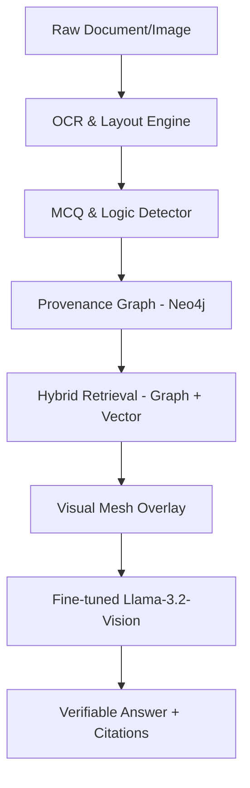

# Project Architecture: Multimodal Traceability Mesh (MTM)

The Multimodal Traceability Mesh (MTM) is an advanced system designed to enhance Vision-Language Models (VLMs) with structural grounding and verifiable provenance. It bridges the gap between raw document images and structured knowledge using a Graph-RAG approach.

## 1. System Overview
MTM implements a multi-stage pipeline that transforms unstructured documents into a structured **Provenance Graph**, which is then used to augment the reasoning capabilities of a fine-tuned Llama-3.2-Vision model.

## 2. Logical Flow

### Stage 1: Document Ingestion & Extraction
*   **OCR Engine:** Uses `PaddleOCR` for high-precision text detection and recognition.
*   **Layout Parsing:** Integrates `pdfplumber` and `PyMuPDF` for PDF-native extraction and layout classification.
*   **Visual Encoding:** Each detected region (block) is encoded into a vector space for semantic search.

### Stage 2: MCQ & Traceability Detection
*   Identifies specific tasks within documents (e.g., Multiple Choice Questions).
*   Uses spatial heuristics to link labels (A, B, C) with their corresponding text content, ensuring logical grouping.

### Stage 3: Provenance Graph Construction (Neo4j)
The system builds a knowledge graph representing the document's internal DNA:
*   **Nodes:** `Document`, `Page`, `Block` (Text/Image), `Question`, `Option`, `Answer`.
*   **Edges:** `CONTAINS`, `HAS_PAGE`, `HAS_OPTION`, `NEXT` (Reading order), `DERIVED_FROM` (Evidence link).

### Stage 4: Multimodal Hybrid Retrieval
When a query is received, MTM performs:
1.  **Vector Search:** Finds semantically relevant text blocks using FAISS.
2.  **Graph Traversal:** Explores neighbors of the found blocks (e.g., surrounding context, section headers) to provide a complete context.

### Stage 5: Visual Mesh Generation
MTM generates a "Visual Mesh"—a synthetic overlay on the document image where nodes and relationships from the graph are rendered. This allows the VLM to "see" the structure of the document as a coordinate-aware graph.

### Stage 6: Grounded Inference & Fine-tuning
The system uses a fine-tuned **Llama-3.2-11B-Vision-Instruct** model (Adapter-based).
*   **SFT Alignment:** The model is trained on data where prompts include a textual representation of the `[PROVENANCE_GRAPH]` and images include the Visual Mesh.
*   **Citation Requirement:** The model is incentivized to provide citations (e.g., `[B4]`) that link directly back to nodes in the Neo4j graph.

## 3. Data Schema (Neo4j)
| Node Label | Key Properties |
| :--- | :--- |
| **Document** | `id`, `filename`, `page_count` |
| **Page** | `id`, `page_no`, `width`, `height` |
| **Block** | `id`, `text`, `bbox`, `type` (text/image) |
| **Question** | `id`, `stem_text`, `index` |
| **Option** | `id`, `label`, `text` |

## 4. Fine-tuning Logic
Fine-tuning focuses on two primary objectives:
1.  **Structural Adherence:** Following the graph context provided in the system prompt.
2.  **Hallucination Suppression:** Using the Visual Mesh to verify spatial claims before generating output.
3.  **Traceability:** Ensuring every answer is backed by a verified `DERIVED_FROM` relationship in the graph.
